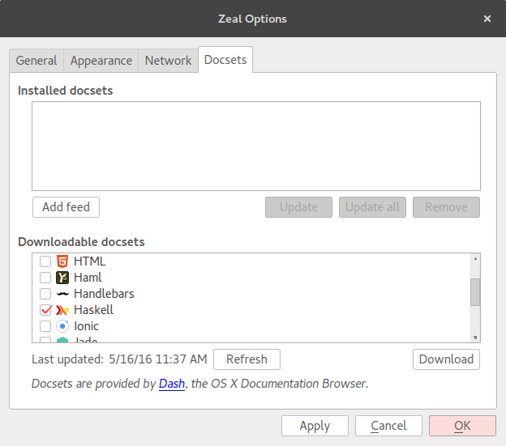
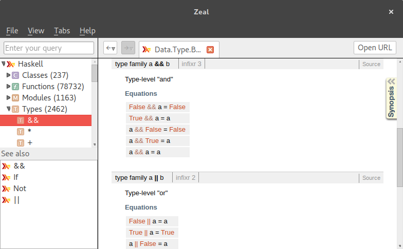

<!-- markdown-toc start - Don't edit this section. Run M-x markdown-toc-generate-toc again -->

## Taller de Hackerrank ##

- [Requisitos](#requisitos)
    - [Stack](#stack)
    - [Zeal/Dash/Hoogle (opcional)](#zealdashhoogle-opcional)
- [Ejercicios](#ejercicios)

<!-- markdown-toc end -->


## Requisitos ##

Dado que este taller utiliza los ejercicios de FP de [Hackerrank](https://www.hackerrank.com/domains/fp/intro) no es necesario tener el entorno configurado en local ya que los ejercicios se pueden ejecutar antes de validarse en la misma página de Hackerrank. No obstante os recomendamos hacer los ejercicios a ser posible en local para que os familiaricéis más con la forma de desarrollar proyectos en Haskell.

### Stack (opcional) ###

Stack es un programa que nos va a ayudar a instalar de forma aislada el compilador GHC *(Glasgow Haskell Compiler)* que es el compilador *defacto* de Haskell, así como compilar nuestro programa e instalar dependencias.

Para instalar Stack podéis seguir los pasos que se indican en el [sitio web de Stack](http://docs.haskellstack.org/en/stable/README/), o bien podéis trabajar dentro de un contenedor de docker que usa una imagen con Stack ya instalado:

``` sh
docker run -ti --volume $(pwd):/app sellpy/haskell-stack bash
```

Una vez tengáis Stack instalado probad a compilar el proyecto que contiene los ejercicios del taller:

``` sh
git clone https://github.com/haskellMAD/taller-hackerrank.git
cd taller-hackerrank
stack build
```

Si el comando `stack build` termina sin dar ningún error tendremos cinco ejecutables, uno por cada ejercicio del taller (que son cinco). Cada ejecutable se llama `exN` donde `N` es el número del ejercicio, para invocar un ejecutable podéis utilizar el comando `stack exec exN` y en los ficheros en los que tenéis que trabajar son `exN/Main.hs` donde `N` es también el úmero del ejercicio en el que vais a trabajar.

Los comandos de stack con los que más vamos a trabajar son:

- `stack build` para compilar nuestro proyecto, en el fichero `taller-hackerrank.cabal` podéis definir tantos ejecutables como queráis generar, por defecto he dejado dos para los dos primeros ejercicios.
- `stack exec exN` para ejecutar nuestra solución al ejercicio `N`.
- `stack ghci --main-is exN` para lanzar una shell interactiva para un ejercicio, una vez dentro de esta shell escribe `:l Main` para cargar el módulo `Main` del ejercicio `N`.

### Zeal/Dash/Hoogle (opcional) ###

[Zeal](https://zealdocs.org/)/[Dash](https://kapeli.com/dash) son dos programas (Zeal para Gnu/Linux y Dash para OSX) que te permiten navegar fácilmente y totalmente *offline* documentaciones de varias herramientas y lenguajes. En nuestro caso nos instalaremos el docset de Haskell (ver opciones → instalar docset).



Una vez descargado el docset puedes acceder o buscar en la documentación de Haskell.



[Hoogle](https://wiki.haskell.org/Hoogle#Searches) es un programa de línea de comandos que una de las cosas interesantes que tiene es que nos permite buscar por *type signatures*. Para instalarlo podéis usar el mismo Stack: `stack install hoogle` y una vez instalado ejecutad `hoogle data` para que se cree el índice local.

Luego de esto podemos fácilmente buscar desde nuestro terminal por nombre de función:
``` sh
$ hoogle getArgs
System.Environment getArgs :: IO [String]
System.Posix.Env.ByteString getArgs :: IO [ByteString]
Graphics.UI.GLUT.Initialization getArgsAndInitialize :: MonadIO m => m (String, [String])
```

Podemos pedir que muestre la documentación [Haddock](https://www.haskell.org/haddock/) de una función:
``` sh
$ hoogle --info getArgs
System.Environment getArgs :: IO [String]

Computation getArgs returns a list of the program's command line arguments (not including the program name). 

From package base
getArgs :: IO [String]
```

Podemos también buscar por *type signature*:
``` sh
$ hoogle 'x a -> x b -> x b' | head
Control.Applicative (*>) :: Applicative f => f a -> f b -> f b
Prelude (>>) :: Monad m => m a -> m b -> m b
Control.Monad (>>) :: Monad m => m a -> m b -> m b
Control.Monad.Instances (>>) :: Monad m => m a -> m b -> m b
Control.Applicative (<*) :: Applicative f => f a -> f b -> f a
Control.Exception.Base finally :: IO a -> IO b -> IO a
Control.Exception finally :: IO a -> IO b -> IO a
Control.OldException finally :: IO a -> IO b -> IO a
Control.Exception.Base onException :: IO a -> IO b -> IO a
Control.Exception onException :: IO a -> IO b -> IO a
```

También podéis acceder a hoogle desde la repl ghci, para ello salvad lo siguiente en `$HOME/.ghci`:

``` haskell
let ghciEscapeShellArg arg = "'" ++ concatMap (\c -> if c == '\'' then "'\"'\"'" else [c]) arg ++ "'"
:def! search return . (":! hoogle " ++) . ghciEscapeShellArg
:def! doc return . (":! hoogle --info " ++) . ghciEscapeShellArg
```

El fichero anterior define dos nuevos comandos en nuestro ghci: `:search` y `:doc`, el primero simplemente busca y el segundo además de buscar muestra la documentación de Haddock, por ejemplo:

``` sh
$ ghci
GHCi, version 7.10.3: http://www.haskell.org/ghc/  :? for help
Prelude> :doc getArgs
System.Environment getArgs :: IO [String]

Computation getArgs returns a list of the program's command line arguments (not including the program name). 

From package base
getArgs :: IO [String]
Prelude> :search getArgs
System.Environment getArgs :: IO [String]
System.Posix.Env.ByteString getArgs :: IO [ByteString]
Graphics.UI.GLUT.Initialization getArgsAndInitialize :: MonadIO m => m (String, [String])
Prelude> 
```

## Ejercicios ##

¡Ve a la [página de ejercicios de FP](https://www.hackerrank.com/domains/fp/intro) de Hackerrank y comienza a trabajar en ellos!

### Si eres novato ###

El primer ejercicio que hay se llama **Solve me first** y su propósito es que veas cómo funciona todo. Los ejercicios se componen de:

- Una descripción del problema
- El formato de entrada de nuestro programa
- El formato de salida que debe dar nuestro programa
- (opcional) Restricciones que cumple la entrada de nuestro programa
- Un ejemplo de entrada que recibirá nuestro programa
- Un ejemplo de la salida que debe dar nuestro programa

Luego en el editor embebido es donde escribiremos nuestro código. El editor soporta varios lenguajes, si aún no está seleccionado, seleccionad Haskell como lenguaje y veréis que el editor mostrará este código de plantilla para que comencemos a trabajar:

``` haskell
solveMeFirst a b = a + b

main = do
    val1 <- readLn
    val2 <- readLn
    let sum = solveMeFirst val1 val2
    print sum
```

Si aún no conocéis mucho Haskell podéis empezando leyendo los siguientes enlaces que os enseñarán a entender el fragmento de código anterior:
- [Definir y llamar funciones](http://aprendehaskell.es/content/Empezando.html#las-primeras-pequenas-funciones), necesario para entender el fragmento `solveMeFirst...`
- [Entrada/Salida](http://aprendehaskell.es/content/EntradaSalida.html#hola-mundo), necesario para entender el fragmento `main = do...`
- [La notación Do](http://aprendehaskell.es/content/Monadas.html#la-notacion-do) por si queréis aprender que la notación do es solo azúcar sintáctico de Haskell para crear código que nos recuerda al código de lenguajes imperativos.
- [Functors, Applicatives and Monads in pictures](http://adit.io/posts/2013-04-17-functors,_applicatives,_and_monads_in_pictures.html) para que os familiaricéis con las abstracciones más comunes de Haskell

Si estáis trabajando en local podéis compilar el proyecto con `stack build` y ejecutar alguno de los ejecutables con `stack exec <nombre del ejecutable: ex1 | ex2 | ...>`.

No os preocupéis que el equipo de HaskellMAD estará pendiente de explicaros todo lo que saben (que aún no es mucho) al respecto :)
